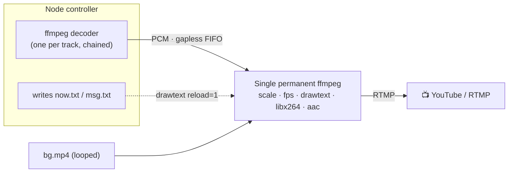

<div align="center">

# 🎵 lofi-radio

### Your own 24/7 music radio, livestreaming to YouTube from a tiny VPS.

A self-hosted radio that streams your music to **YouTube Live** (or any RTMP target)
around the clock — with a clean web dashboard, a live **"Now Playing"** overlay,
**hot-swappable** playlists, a **TV-grid scheduler**, and a **gapless permanent engine**
that never reconnects between tracks.

[](https://github.com/Bkr54/lofi-radio/actions/workflows/ci.yml)
[](LICENSE)


**No GPU. ~0.5 CPU core at 720p24. Runs on a $5 VPS.**

</div>

> [!NOTE]
> You bring your own music and video — nothing copyrighted is shipped. Make sure you
> have the rights to broadcast whatever you stream.

---

## ✨ Features

| | |
|---|---|
| 🎛️ **Web dashboard** | Start/stop, status, uptime, now playing, progress — over WebSocket |
| 🔤 **Live overlays** | "Now Playing" + a rotating message, burned into the video, updated hot |
| 🔁 **Hot-swap** | Change playlist or background **without cutting** the stream |
| 📺 **TV-grid scheduler** | Drop full video "programs" in on a weekly grid, then auto-return to music |
| ⚡ **Gapless engine** | One permanent `ffmpeg` → **0 RTMP reconnects between tracks**, smooth ingest |
| 🔒 **Secure by default** | scrypt-hashed login, secrets in `.env`, sandboxed systemd unit, HTTPS templates |
| 🔔 **Optional alerts** | Push notifications via [ntfy.sh](https://ntfy.sh) (up / down / stall / disk) |

---

## ⚡ How it works

One long-lived `ffmpeg` encodes the stream forever. Audio is fed **gaplessly** through a
pipe (each track decoded to PCM and chained), and the on-screen text is reloaded live
from a file — so tracks change with **no gap and no reconnect**.



Full design notes: [`docs/ENGINE.md`](docs/ENGINE.md) · architecture: [`docs/ARCHITECTURE.md`](docs/ARCHITECTURE.md)

---

## 🧱 Requirements

- A Linux VPS (Debian/Ubuntu tested), **Node.js ≥ 18**, **ffmpeg** (with `ffprobe`)
- A YouTube (or other) **RTMP stream key**
- *Optional:* a domain + nginx + certbot for HTTPS

```bash
sudo apt update && sudo apt install -y ffmpeg
# install Node 18+ via nodesource or nvm
```

---

## 🚀 Quick start

<details open>
<summary><b>Option A — guided installer (recommended)</b></summary>

```bash
git clone https://github.com/Bkr54/lofi-radio.git
cd lofi-radio
sudo bash deploy/install.sh
```

The installer checks dependencies, creates an unprivileged user, installs dependencies,
generates your `.env` (random session secret + scrypt password hash), and installs the
systemd service. Then add media and start it.

</details>

<details>
<summary><b>Option B — manual</b></summary>

```bash
git clone https://github.com/Bkr54/lofi-radio.git
cd lofi-radio
npm install --omit=dev

cp .env.example .env
npm run set-password -- "YourStrongPassword"   # paste the printed hash into .env
nano .env                                       # set STREAM_KEY, SESSION_SECRET, PORT...

cp config/stream.example.json config/stream.json
cp config/schedule.example.json config/schedule.json

# add your media (see media/README.md), then:
npm start
```

</details>

Open `http://localhost:PORT` (or your domain behind nginx), log in, pick a playlist +
background, and click **Start**.

---

## 🎚️ Configuration

All secrets live in **`.env`** (never in code or tracked JSON). See `.env.example` for
the full list.

| Variable | Meaning |
|---|---|
| `PORT` | Local port the dashboard listens on |
| `STREAM_URL` | RTMP base (default: YouTube Live) |
| `STREAM_KEY` | Your stream key — **secret** |
| `SESSION_SECRET` | Random session signing secret |
| `DASHBOARD_PASSWORD_HASH` | scrypt hash from `npm run set-password` |
| `COOKIE_SECURE` | `1` behind HTTPS, `0` for local HTTP |

Non-secret encoding settings (resolution, fps, bitrates) live in `config/stream.json`
(copy from the example). **720p@24** is a great low-CPU default.

---

## 🎶 Adding music & video

A **playlist** is simply a sub-folder of `media/mp3/` containing `.mp3` files:

```
media/mp3/lofi/*.mp3      ->  playlist "lofi"
media/mp3/focus/*.mp3     ->  playlist "focus"
media/mp4/bg/*.mp4        ->  background loops
media/mp4/video/*.mp4     ->  scheduler "programs"
```

One level only (no recursive sub-folders). Refresh the dashboard to see new ones.
Details + a CPU-saving background tip: [`media/README.md`](media/README.md).

---

## 🔒 Security & operations

- Dashboard password is **scrypt-hashed** and verified timing-safe
- Run behind **nginx + HTTPS** (templates in `deploy/`) with `COOKIE_SECURE=1`
- The systemd unit runs as an **unprivileged, sandboxed** user
- A `/healthz` endpoint exposes non-sensitive status for monitoring
- Optional `deploy/monitor-stream.sh` → cron → ntfy push alerts

You can validate the engine locally **without YouTube** (renders to a file):

```bash
V2_TRACK_LIMIT_SEC=20 node bin/v2-selftest.js <playlist> <background.mp4> 75
```

---

## 📁 Project structure

```
src/                 application
  server.js          HTTP/WebSocket server + REST API + auth
  streamEngineV2.js  the permanent / gapless streaming engine
  broadcastScheduler.js  TV-grid / program scheduler
  config.js, logger.js
public/ , views/     dashboard UI
config/              non-secret runtime config (*.example.json)
deploy/              systemd + nginx templates, installer, monitor
bin/                 set-password, self-test
docs/                engine & architecture notes
```

---

## 🤝 Contributing

Issues and PRs welcome — see [CONTRIBUTING.md](CONTRIBUTING.md). If lofi-radio is useful
to you, a ⭐ helps others find it.

## 📜 License

[MIT](LICENSE). Provided as-is; you are responsible for the content you broadcast and for
complying with YouTube's and your rights holders' terms.
