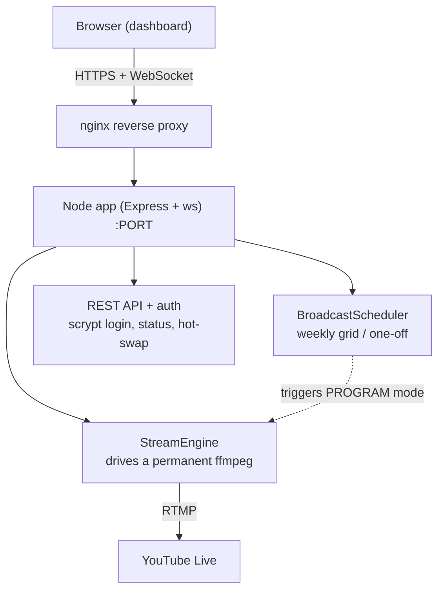

# Architecture

## Components

- **`src/server.js`** — Express HTTP server + WebSocket broadcaster + REST API.
  Handles auth (scrypt, timing-safe), serves the dashboard, exposes `/healthz`, and
  relays engine/scheduler events to connected clients over WebSocket.

- **`src/streamEngineV2.js`** — the permanent, gapless streaming engine: one long-lived
  `ffmpeg`, gapless audio via a FIFO, overlays via `drawtext textfile reload`. See
  [`ENGINE.md`](ENGINE.md).

- **`src/broadcastScheduler.js`** — weekly grid + one-off events; switches the engine
  into PROGRAM mode (a full video with its own audio) and back to MUSIC.

- **`src/config.js`** — loads non-secret settings from `config/stream.json` and injects
  secrets (`STREAM_KEY`, `DASHBOARD_PASSWORD_HASH`) from the environment. Never writes
  secrets back to disk.

- **`src/logger.js`** — winston logger (console + rotating files).

## Modes

- **MUSIC** — playlist audio over a looping background video (default).
- **PROGRAM** — a scheduled full video takes over (its own audio), then auto-returns to
  MUSIC. Triggered by the scheduler or "play now".

## Data flow for "Now Playing"

`engine → trackChange event → WebSocket → dashboard`, and in parallel the engine writes
the on-screen text (overlay file) so the burned-in video matches the dashboard.

## Security model

- Unprivileged, sandboxed systemd service (`ProtectSystem=strict`, `NoNewPrivileges`,
  restricted address families, `ReadWritePaths` limited to the app dir).
- Secrets only in `.env` (chmod 600). Password stored as a scrypt hash.
- Designed to sit behind nginx with HTTPS and `secure` cookies.
- `ffmpeg` detection in the optional monitor is scoped to the service user, so multiple
  instances on one host never interfere.
