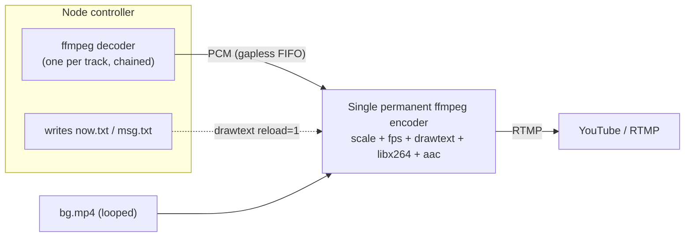

# The streaming engine (permanent / gapless)

lofi-radio runs **one long-lived `ffmpeg` process** for the whole broadcast. This
is what makes it smooth: tracks change with **zero RTMP reconnects** and no audio gap.

## The problem it solves

The naive way to build a music radio is to **restart `ffmpeg` for every track** (to
refresh the "Now Playing" text). It's simple, but each restart **reconnects to RTMP**
— hundreds of reconnects per day on a 24/7 stream — and the small ingest hiccups can
show up as buffering and get flagged by YouTube.

This engine keeps a single encoder alive and solves the two things a restart used to do:

1. **Gapless audio** — a named pipe (FIFO) is fed continuously: the controller decodes
   each mp3 to raw PCM and concatenates the byte streams into the pipe. `ffmpeg` reads
   one endless audio input, so there's no gap and no reconnect between tracks. Natural
   FIFO back-pressure paces the feeder to real time.
2. **Live overlays** — `drawtext=textfile=...:reload=1` reads the on-screen text from a
   file the controller rewrites on each track change. Text updates hot, no restart.



## What you get

| | This engine |
|---|---|
| `ffmpeg` processes | one, long-lived |
| RTMP reconnects between tracks | **0** |
| CPU peaks on track change | **none** (no per-track x264 re-init) |
| Now Playing / rotating message | ✅ live via textfile reload |
| Hot-swap playlist without cutting | ✅ (swaps the feeder queue) |
| Hot-swap background / overlay layout | brief controlled restart (rare manual action) |
| Scheduled programs (TV grid) | controlled reconnect in/out (rare) |

## Hybrid behaviour

The engine is **permanent for MUSIC** (the 99% case) and only accepts a **single
controlled reconnect** at **program boundaries** (entering/leaving a scheduled video,
which carries its own audio) or when you change the background. Those events are rare,
so you remove the hundreds of per-track reconnects while avoiding the hardest part —
switching a live `ffmpeg`'s video input on the fly.

## Validate locally (no YouTube needed)

`bin/v2-selftest.js` runs the real pipeline to a **local file** and checks that a single
encoder survives several track boundaries with zero reconnects:

```bash
V2_TRACK_LIMIT_SEC=20 node bin/v2-selftest.js <playlist> <background.mp4> 75
```

## Notes / ideas

- Track boundaries are gapless to the ear but not sample-perfect (a few ms while the
  next decoder spawns). Pre-spawning the next decoder would make it exact.
- Switching the **background video** inside the running encoder is intentionally done
  with a brief controlled restart rather than live filter-graph surgery.
